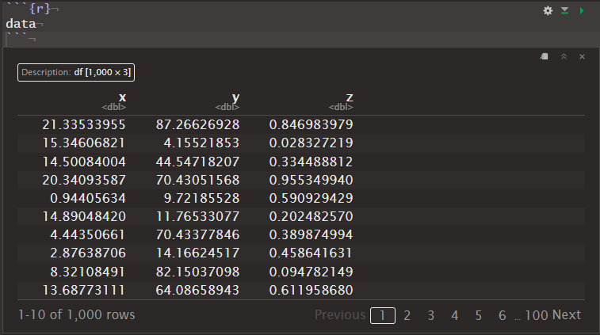
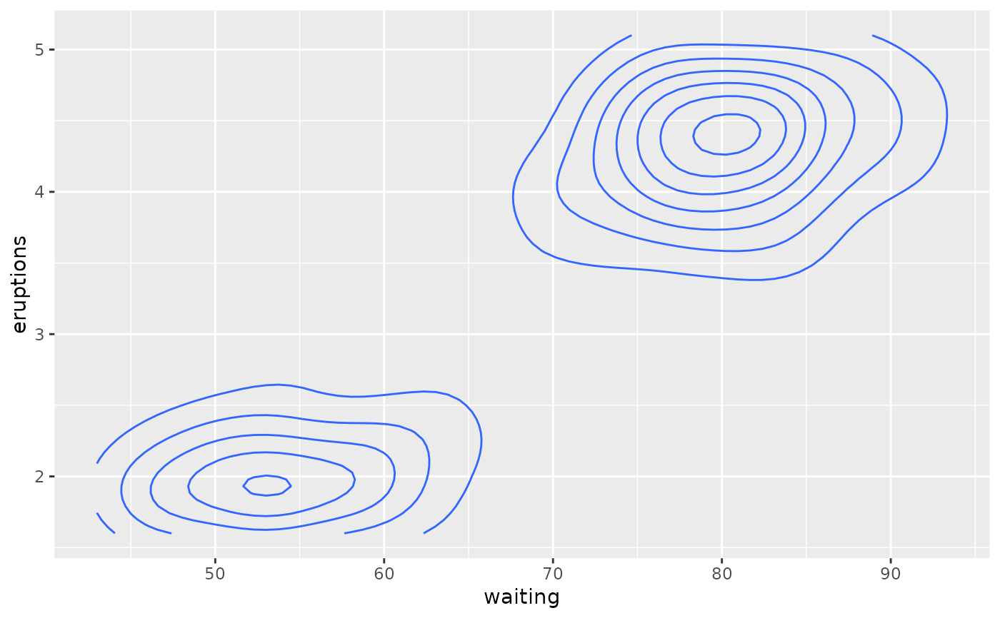
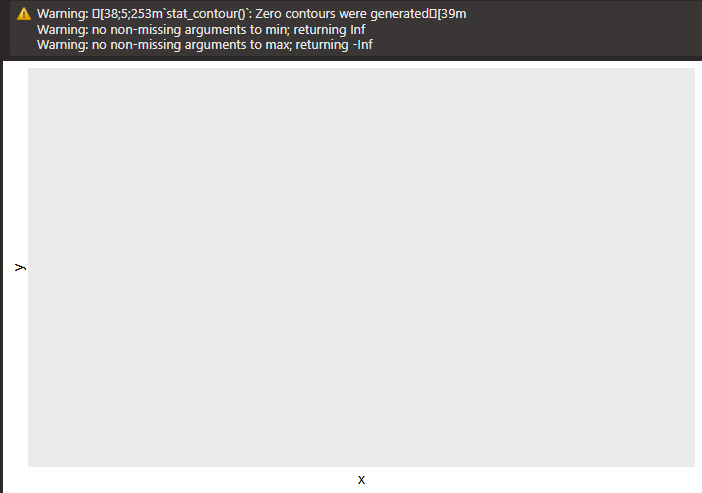
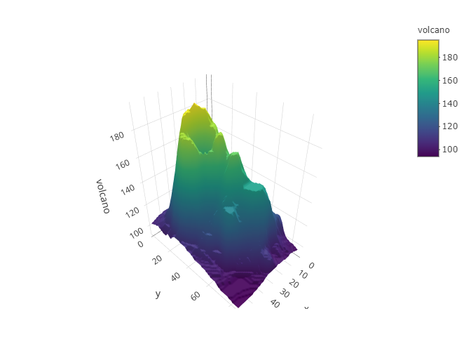
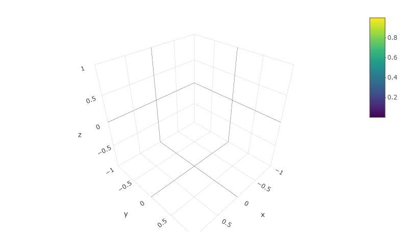
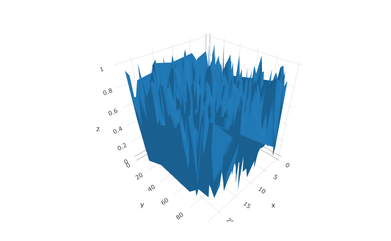

## 初めに

研究の一環で、教授から「このデータは3Ⅾサーフェスプロット使えば良い感じに図示できるんじゃない？来週までにやっておいてね」と言われたのでR言語を使って3Dのグラフ可視化に取り組みました。予想以上に手間取ったので記録に残しておきたいと思います。


- [初めに](#初めに)
- [使用言語、パッケージ](#使用言語パッケージ)
- [データ](#データ)
- [その１: ggplot](#その１-ggplot)
- [その２: plotly](#その２-plotly)
- [終わりに](#終わりに)

## 使用言語、パッケージ
RStudio v4.3-1を使用しています。
パッケージは以下の二つです。

```R
library(tidyverse) #v.2.0.0
library(plotly) # v4.10.3
```

## データ

シンプルに三変数のデータフレームです。

```R

# Set the number of rows
n_rows <- 1000

# Create a data frame with random data
data <- data.frame(
  x = runif(n_rows, min = 0, max = 23),
  y = runif(n_rows, min = 0, max = 100),
  z = runif(n_rows, min = 0, max = 1)
)

```
中身を見てみるとこんな感じです。



## その１: ggplot

::: note

結論からいうと`ggplot`を使うのは諦めました。

:::

`ggplot`をひたすらに使ってきた`tidyverse`信者なので、とりあえずは`ggplot`でどうにかできないか考えます。`ggplot`は3Dとはあんまり相性が良くないので、同じメッセージを伝えられるプロットはないかなと探してみたら[こちら](https://ggplot2.tidyverse.org/reference/geom_contour.html)を見つけました。

参考コードより
```R
# Basic plot
v <- ggplot(faithfuld, aes(waiting, eruptions, z = density))
v + geom_contour()
```


こういうものが自前のデータでも作れたら結構嬉しいです。

では、いざ。

```R
data |>
  ggplot(aes(x, y, z = z)) +
  geom_contour()
```


あれ？？？？？？

なんで？？？

ダメだったのでドキュメントを読み直してみたら、こんな一文が~~一段落目に~~ありました。"These functions require regular data, where the x and y coordinates form an equally spaced grid, and each combination of x and y appears once. Missing values of z are allowed, but contouring will only work for grid points where all four corners are non-missing."

$xy$平面上に存在しない点があってはいけないらしいです。例えば$x$軸が$c(1,2,3,4)$で$y$軸も$c(1,2,3,4)$だった場合、$(1,1), (1,2), ... (4,3), (4,4)$の16ポイント全てにおいてデータが存在していないと平面の計算が出来ないということみたいです。

`geom_contour()`を使いたいなら他のパッケージ(`interp::interp()`, `akima::bilinar()`)を使って全ての点を埋めてからということだったので、一旦撤退して他の手を考えます。

## その２: plotly

ということでRのグラフ描画で`ggplot`と双璧を為す`plotly`を見ていきます。

検索すると、[こちら](https://plotly.com/r/3d-surface-plots/)がヒットしました。`plot_ly()`の`add_surface()`を使えば何とかなるようです。

参考コードより
```R
# volcano is a numeric matrix that ships with R
fig <- plot_ly(z = ~volcano)
fig <- fig |> add_surface()

fig
```


シンプルなコードで良さそうです。
自前のデータでも試してみます。

```R
plot_ly(x = data$x, y = data$y, z = data$z) |>
  add_surface()
```

> Error: `z` must be a numeric matrix

ベクターではなくてマトリックスにしないといけないようです。

```R
z_matrix <- matrix(data$z, nrow = nrow(data))
plot_ly(x = data$x, y = data$y, z = z_matrix) |>
  add_surface()
```



はいだめー。

これがなんでダメなのかは色々読んでみたのですがイマイチわかりませんでした。誰かわかる方いらっしゃったら教えてください。

いろいろ探している途中でこんな[ページ](https://stackoverflow.com/questions/43620494/3d-surface-with-plot-ly-in-r-with-x-y-z-coordinates)を見つけました。(Stackoverflow様様)

ここの返答に書いてある通りに`add_trace()`と`mesh3d`を使ってみます。

```R

plot_ly() %>% 
  add_trace(
    data = data,  
    x=data$x, 
    y=data$y, 
    z=data$z, 
    type="mesh3d"
) 

```



できた！！！

`add_surface()`では出来なかったものが`add_trace()`では出来ることが分かったので、違いをChatGPTに訊いてみました。

> In Plotly, the choice between using `add_trace()` or `add_surface()` largely depends on the type of data and the visualization you want to create. There are situations where `add_trace()` is more appropriate, and others where `add_surface()` is the better choice. Here are some scenarios where one may be preferred over the other:

> **Use `add_trace()` when**:
> 1. **2D Data:** If your data is primarily 2D (e.g., x, y, and optionally z), and you want to create standard 2D plots, such as scatter plots, bar charts, line charts, or heatmaps, then `add_trace()` is the suitable choice.
> 2. **Mixed Chart Types:** When you want to combine multiple types of charts within the same plot, such as overlaying a scatter plot on top of a bar chart, `add_trace()` allows you to add diverse trace types to the same figure.
> 3. **Customization:** If you need a high level of customization for your plot, including control over trace appearance, colors, markers, and other style elements, `add_trace()` provides more flexibility.

> **Use `add_surface()` when**:
> 1. **3D Surface Plots:** If your data is in a 3D format (x, y, z) and you want to visualize it as a 3D surface, such as elevation maps, terrain models, or other continuous surfaces, `add_surface()` is designed specifically for this purpose.
> 2. **Elevation Data:** When you have data that represents elevation, heatmaps, contour plots, or any scenario where the z-values represent surface heights or intensities, `add_surface()` is the appropriate choice.
> 3. **Smooth 3D Visualization:** `add_surface()` is designed for creating smooth and continuous 3D surfaces, making it ideal for datasets that can be represented as such.

>   In summary, the choice between `add_trace()` and `add_surface()` depends on the nature of your data and the type of visualization you want to achieve. While `add_trace()` is versatile and can handle a wide range of chart types, `add_surface()` is specialized for creating 3D surface plots. The functionality you require and the type of data you have will guide your decision between the two functions.


ここから考えられる原因としては、ランダムにデータを生成したため"creating smooth and continuous 3D surfaces"が出来なかったというところでしょうか。有識者の方のご意見お待ちしております。

## 終わりに

`plotly`様、いままで`ggplot`ばっかり優先して無視していてごめんなさい。

