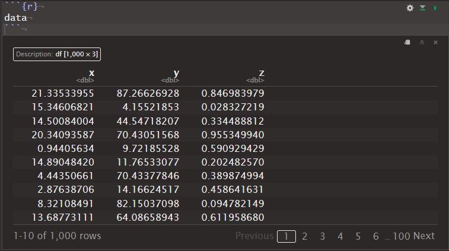

## 初めに

研究の一環で、教授から「このデータは3Ⅾサーフェスプロット使えば良い感じに図示できるんじゃない？来週までにやっておいてね」と言われたのでR言語を使って3Dのグラフ可視化に取り組みました。予想以上に手間取ったので記録に残しておきたいと思います。

## 使用言語、パッケージ
RStudio v4.3-1を使用しています。
パッケージは以下の二つです。

```R
library(tidyverse) #v.2.0.0
library(plotly) # v4.10.3
```

## データ

シンプルに三変数のデータフレームです。

```R

# Set the number of rows
n_rows <- 1000

# Create a data frame with random data
data <- data.frame(
  x = runif(n_rows, min = 0, max = 23),
  y = runif(n_rows, min = 0, max = 100),
  z = runif(n_rows, min = 0, max = 1)
)

```
中身を見てみるとこんな感じです。


